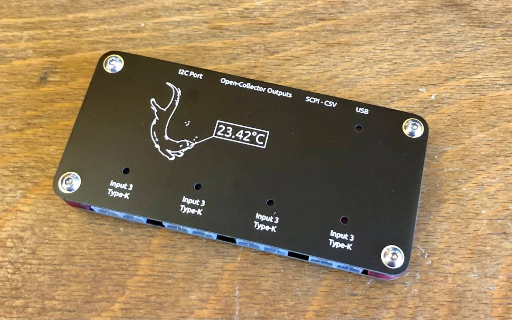
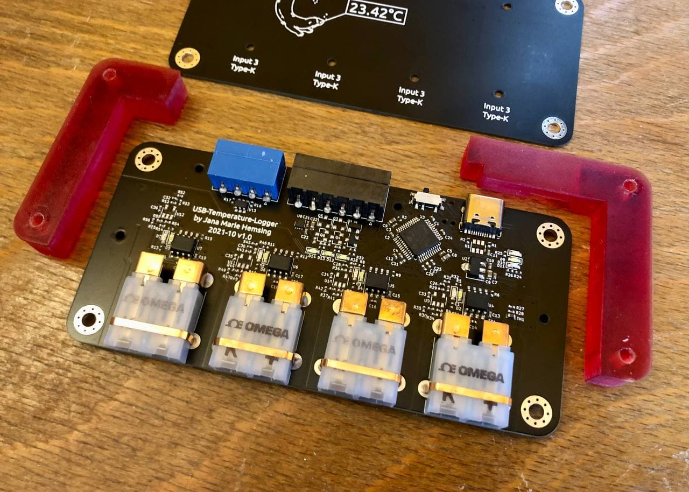
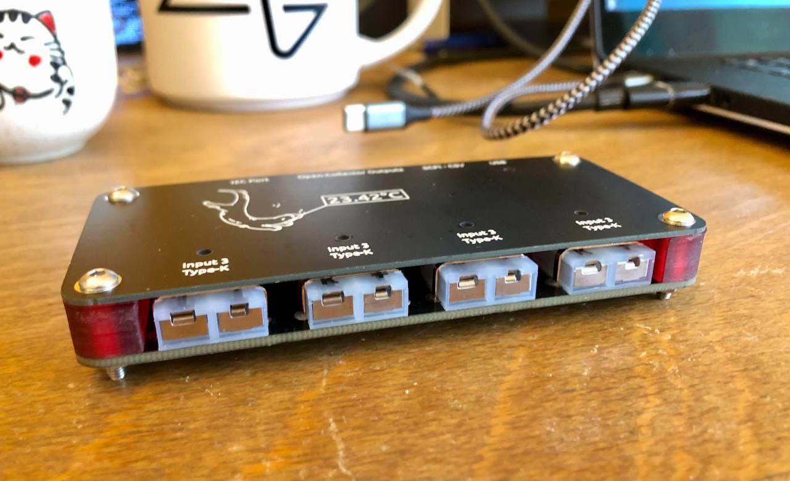

# temperature-logger

Anotter USB temperature logger that can record up to four channels with thermocouple or NTCs connected via CDC directly or SCPI to USB. You can choose how you want to receive the data by moving the selector switch next to the Type-C receptacle. If you switch to CSV, it will simply output all connected channels to your console in a machine and human readable format (CSV or TSV, I prefer TSV) at about 10 readings per second. If you switch to SCPI, an SCPI terminal is displayed via USB so that you can integrate the logger into your lab equipment. This is particularly handy because you can also use it to control the OC- or H-Bridge outputs, which turns the logger into a thermal IO card. This can be useful when working with Peltier- and heating elements.

Having needed a temperature logger several times in the past, after hacking two together for spontaneous testing, I decided to develop a proper one. This is my result. :3

### Inputs

Each of the four inputs can either be configured as thermocouple or NTC (resistance measuring) input. At the moment they are assembly options, I need to test if I can assmble both at the same time.

**thermocouple**

One MAX31855KASA can be populated per channel, enabling the reading of K-type thermocouples. Other versions of this IC are available if other thermocouple types are required.

**NTC**

The NTC amplifier is based on [this appnote](https://www.ti.com/lit/an/sboa323a/sboa323a.pdf) and allows amplification of small ranges to the full ADC range. This was an important motivation for this project as I needed a multi-channel body temperature logger.

If you want to know more, you can check out the [schematic](https://github.com/Jana-Marie/temperature-logger/blob/main/temperature-logger.pdf).

### TODO

 - [ ] implement SCPI - done in the SCPI branch, check it out, but there is not much space left on the STM32, hence no merge yet
 - [ ] add sigrok communication/protocol 

### License

Copyright Jana Marie Hemsing 2023.

This source describes Open Hardware and is licensed under the CERN-OHL-S v2.

You may redistribute and modify this source and make products using it under
the terms of the CERN-OHL-S v2 (https://ohwr.org/cern_ohl_s_v2.txt).

This source is distributed WITHOUT ANY EXPRESS OR IMPLIED WARRANTY,
INCLUDING OF MERCHANTABILITY, SATISFACTORY QUALITY AND FITNESS FOR A
PARTICULAR PURPOSE. Please see the CERN-OHL-S v2 for applicable conditions.

Source location: https://github.com/Jana-Marie/temperature-logger

As per CERN-OHL-S v2 section 4, should You produce hardware based on this
source, You must where practicable maintain the Source Location visible
on the external case of the Gizmo or other products you make using this
source.
